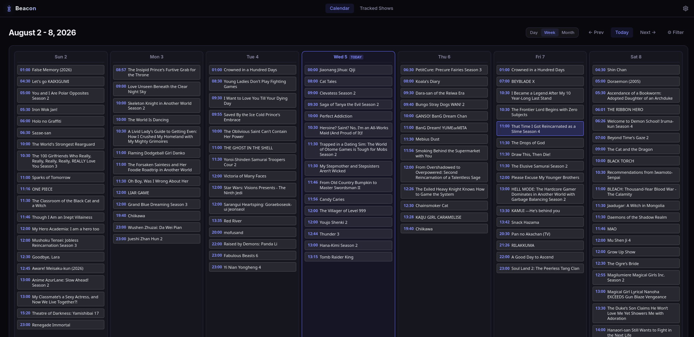

# Beacon - Anime Calendar & Tracker

<p align="center">
  
</p>

A fast anime release calendar and RSS tracking (AniList API, Jikan (MAL) API, Nyaa RSS) pipeline built with Rust (Axum) and SolidJS.

## Local Setup & Running

### Environment & Development

```bash
# Environment setup
cp .env.example .env

# Launch via Docker Compose
docker compose up -d

# Frontend dev mode
cd frontend
pnpm install
pnpm run dev

# Backend dev mode
cd services/nyaa-service
cargo run
```

### Hosts Configuration
Add `anime.local` to your hosts file (`/etc/hosts` on Linux/macOS or `C:\Windows\System32\drivers\etc\hosts` on Windows):
```text
127.0.0.1 anime.local
```

### Running Verification & Tests

```bash
# Run full project check
pnpm --prefix frontend run check
```
