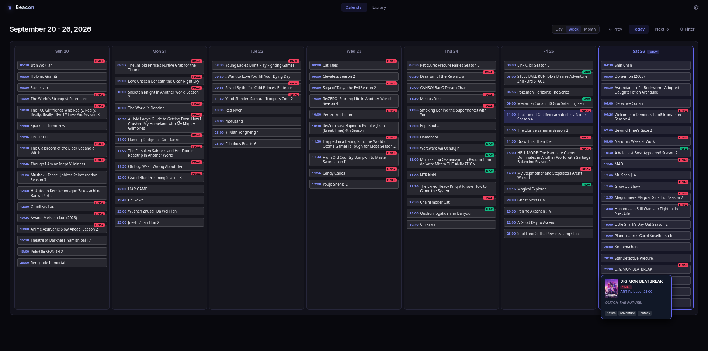

# Beacon - Anime Calendar & Tracker

<p align="center">
  
</p>

A fast anime release calendar and RSS tracking (AniList API, Jikan (MAL) API, Nyaa RSS) pipeline built with Rust (Axum) and SolidJS.

## Local Setup & Running

### Native (recommended on Windows — no Docker/WSL overhead)

```bash
# Build once
cd services/nyaa-service && cargo build --release && cd ../..
cd frontend && pnpm install && pnpm run build && cd ..

# Run (PowerShell)
$env:PORT = '58889'
$env:SQLITE_DB_PATH = "$PWD\data\nyaa-service\anime.db"
Start-Process .\services\nyaa-service\target\release\nyaa-service.exe
caddy run --config Caddyfile.native
```

On Windows, `Beacon.vbs` in the Startup folder launches both automatically at logon (no Docker Desktop involved). Combined idle footprint is ~70MB, vs. multiple GB for the old Docker Desktop/WSL2 VM.

On Linux, use two systemd user units instead (`~/.config/systemd/user/beacon-nyaa.service` running the release binary, `beacon-caddy.service` running `caddy run --config Caddyfile.native`, `After=`/`Requires=` chained) — `systemctl --user enable --now beacon-nyaa beacon-caddy` plus `loginctl enable-linger $USER` for boot-time autostart without a login session.

### Docker Compose (Linux/Bazzite via Podman, or on-demand start/stop via Sablier)

```bash
# Environment setup
cp .env.example .env

# Launch via Docker Compose — includes Sablier + Caddy for start-on-request/stop-on-idle
docker compose up -d
```

`docker-compose.yml` and `Caddyfile` (the Docker-flavored one, distinct from `Caddyfile.native`) are still used for this path. Sablier supports Podman as a provider (`--provider.name=podman`), so the same compose file works under `podman-compose` on Bazzite with that one flag changed.

### Development

```bash
# Frontend dev mode
cd frontend
pnpm install
pnpm run dev

# Backend dev mode
cd services/nyaa-service
cargo run
```

### Hosts Configuration
Add `anime.local` to your hosts file (`/etc/hosts` on Linux/macOS or `C:\Windows\System32\drivers\etc\hosts` on Windows):
```text
127.0.0.1 anime.local
```

### Running Verification & Tests

```bash
# Run full project check
pnpm --prefix frontend run check
```
